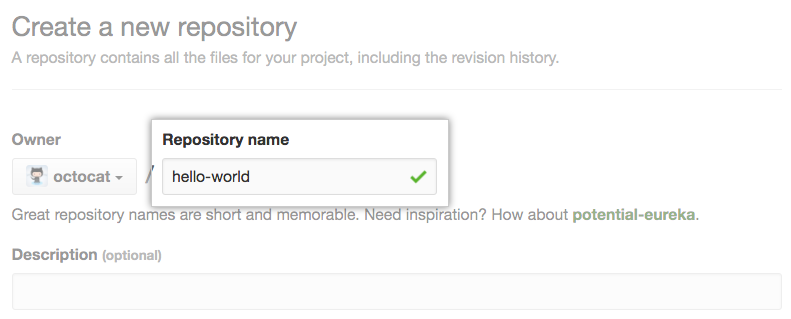

# How To Setup Your Mac For Code

## Change Shell to ZSH

`chsh -s /bin/zsh` _# Changing The Shell Type_

`which $SHELL` _# It should output /bin/zsh_

## Install XCode Tools

`sudo xcode-select --install` _# Then you have to install Xcode From App Store_

## Install Homebrew

`/bin/bash -c "$(curl -fsSL https://raw.githubusercontent.com/Homebrew/install/HEAD/install.sh)"`[Homebrew Website](https://brew.sh/)

`brew update` _# This updates Homebrew_

## Install Git

`brew install git`

## Install Google Chrome

`brew cask install google-chrome`

## Install Chrome Extensions

Notion Web clipper

Google Translate

Hover Zoom

Adblock Plus

Google Keep

Bitdefender Anti-Tracker

Chrome Remote Desktop

Grammarly

Social Blade

Quran Tab

Picture in Picture

## Install Iterm2

`brew cask install iterm2`

Go to `Prefrences` > `Appearance` > `General` > `Theme` > `Minimal`

## Install Visual Studio Code

`brew cask install visual-studio-code`

## Install Kite

`brew cask install kite`

## Install Alfred 4

`brew cask install alfred`

## Install Spectacle

`brew cask install spectacle`

## Install VSCode Extensions

1. .Net Deevlopment

   - .NET Install Tool for Extension Authors
   - C# for Visual Studio Code

2. C And C++ Development

   - C/C++ Extension Pack

3. Data Storage

   - SQL Server (mssql)
   - MySQL

4. Themes and Icons

   - Community Material Theme
   - Material Icon Theme
   - Material Theme
   - One Dark Pro
   - Dark+ Pro

5. Java

   - Java Extension Pack
   - Spring Boot Tools
   - Spring Initializer Java Support
   - Spring Boot Dashboard

6. Web And Mobile

   - HTML Snippets
   - HTML Preview
   - LiveServer
   - CSS Peek
   - JavaScript
   - TypeScript
   - React Extension Pack
   - vue
   - Vue 3 Snippets
   - Vetur
   - Angular Essentials
   - React Native Tools
   - Dart
   - Flutter

7. Python

   - Python
   - Pylance
   - Jupyter

8. PHP

   - PHP Extension Pack

9. Components Management

   - Docker
   - Kubernetes
   - Gardener Kubernetes Service

10. Sharing And Streaming

    - Live Share
    - Live Share Audio
    - Remote-SSH
    - Remote - SSH: Editing Configuration Files
    - Remote - Containers

11. Formmat Code

    - Prettier

12. Git

    - GitHub Pull Requests and Issues
    - GitLens — Git supercharged

13. Write Code Fast

    - Kite AI Code AutoComplete

14. General

    - markdownlint
    - vscode-pdf

15. Vim

    - Vim
    - VimL

16. Node

    - Search node_modules
    - npm
    - npm Intellisense

17. DevOps

    - Azure Tools

## Install Cowsay

`brew install cowsay`

## Install lolacat

`brew install lolacat`

## Install Python and Pip

`brew install python3`

`curl https://bootstrap.pypa.io/get-pip.py -o get-pip.py`

`python3 get-pip.py`

`pip3 install python-dev-tools`

## Installing Virtualenv & Virtualenvwrapper

`sudo pip3 install virtualenvwrapper`

`sudo pip3 install virtualenv`

`python3.8 -m pip install pipenv`

`pip freeze | grep virtualenv` _# to know virtualenvwrapper version_

## Exporting Python Interpreter

```bash
export VIRTUALENVWRAPPER_PYTHON=/usr/local/bin/python3
export VIRTUALENVWRAPPER_VIRTUALENV=/usr/local/bin/virtualenv
```

## Exporting Python Virtualenv and Virtualenvwrapper

```bash
export WORKON_HOME=$HOME/.virtualenvs
export PROJECT_HOME=$HOME/Mycode
export VIRTUALENVWRAPPER_SCRIPT=/usr/local/bin/virtualenvwrapper.sh
source /usr/local/bin/virtualenvwrapper_lazy.sh
```

## Alias Python

```bash
alias python=python3
alias pip=pip3
```

## Install Java

`brew cask install java`

`wget https://download.java.net/java/GA/jdk14.0.1/664493ef4a6946b186ff29eb326336a2/7/GPL/openjdk-14.0.1_osx-x64_bin.tar.gz`

`tar -xf openjdk-14.0.1_osx-x64_bin.tar.gz`

`/usr/libexec/java_home -v 1.8` _# this is how to know wher java installed_

`brew install maven`

## Exporting Java

```bash
export JAVA_HOME=/Library/Java/JavaVirtualMachines/jdk-15.0.1.jdk/Contents/Home
export PATH=$JAVA_HOME/bin:$PATH
```

## Install Dart

`brew tap dart-lang/dart`

`brew install dart`

## Exporting Dart

```bash
export PATH="$PATH":"$HOME/usr/local/opt/dart/libexec"
```

## Install NVM/Node

`brew install node`

`curl -o- https://raw.githubusercontent.com/creationix/nvm/v0.33.11/install.sh | bash`

## Exporting Node and NVM

```bash
export NVM_DIR="$HOME/.nvm"
[ -s "$NVM_DIR/nvm.sh" ] && \. "$NVM_DIR/nvm.sh"
export PATH="/usr/local/bin/npm:/usr/local/bin/node:/usr/local/bin:$PATH"
```

## Install TypeScript

`npm install -g typescript`

## Install Flutter

`git clone https://github.com/flutter/flutter.git -b stable`

`flutter doctor`

`flutter precache`

For more details to install IOS Simulator and Andriod Emulator go to [Flutter Docs](https://flutter.dev/docs/get-started/install/macos)

## Exporting Flutter

```bash
export PATH="$PATH:/Users/aliramy/flutter/bin"
```

## Install CS50 Library on Mac

Download the latest release from [CS50 Github](https://github.com/cs50/libcs50/releases)

Extract libcs50-_._

`cd libcs50-*`

`sudo make install`

## Exporting CS50

```bash
export LIBRARY_PATH=/usr/local/lib
export C_INCLUDE_PATH=/usr/local/include
export LD_LIBRARY_PATH=/usr/local/lib
```

## Install Notion

`brew cask install notion`
[Notion Website](https://www.notion.so/desktop)

## Languages Commands

`dotnet help` _# To know global options for dotnet command_

`csc [C# File Name]` _# To compile C# file to binary_

`mono [The Compiled C# File]` _# To run the C# compiled file_

`javac [Java File Name]` _# read Java declarations and compile them into class files_

`java [Java Class File Name]` _# To launch a class file_

`node [JS File Name]` _# Node is a set of libraries for JavaScript which allows it to be used outside of the browser_

`node -h` _# To know global option about node command_

`npm -h` _# Node Package Manager To know global options about npm command_

`tsc [TypeScript File Name]` _# To compile type script files_

`clang [C/C++/Objective-C File Name]` _# C, C++, and Objective-C compiler_

`man clang` _# to know global options about clang command_

`./[Compiled File Name]` _# To run the program_

`dart help` _# To know global options for dart command_

`flutter help` _# To know global options for flutter command_

## Customize Zsh Layout

`sh -c "\$(curl -fsSL https://raw.githubusercontent.com/ohmyzsh/ohmyzsh/master/tools/install.sh)"` _# Download Oh My Zsh_

### Installing FiraCode Nerd Font From GitHub

[Nerd Font Repo](https://github.com/ryanoasis/nerd-fonts)
[Nerd Font Website](https://www.nerdfonts.com/)

### Install Powerline Fonts

`git clone https://github.com/powerline/fonts.git`

`cd fonts`

`./install.sh`

### Download Iterm Themes

`git clone https://github.com/mbadolato/iTerm2-Color-Schemes.git`

### Change Themes

Open iTerm2 > `Profiles` > `Edit Profiles` > `Colors` > `Color Presets Drop Down` > `Import`.

In the import window, navigate to the “Schemes” folder.

Select all the files so you can import all the color schemes at once.

Simply select whichever color scheme you like.

### Change Font

Open iTerm2 > `Profiles` > `Edit Profiles` > `Text` > `Font Drop Down`.

Select JetBrains Mono

### Install Syntax Highlighting Plugin and Auto Suggestion Plugin

`git clone https://github.com/zsh-users/zsh-autosuggestions.git $ZSH_CUSTOM/plugins/zsh-autosuggestions`

`git clone https://github.com/zsh-users/zsh-syntax-highlighting.git $ZSH_CUSTOM/plugins/zsh-syntax-highlighting`

### Edit The zshrc File

```bash
# If you come from bash you might have to change your $PATH.
export PATH=$HOME/bin:/usr/local/bin:$PATH

# Exporting Path to oh-my-zsh installation.
export ZSH=$HOME/.oh-my-zsh

# Setting ZSH_THEME
ZSH_THEME="agnoster"
#ZSH_THEME="duellj"
#ZSH_THEME="cloud"
#ZSH_THEME="edvardm"
#ZSH_THEME="apple"
#ZSH_THEME="jonathan"
#ZSH_THEME="intheloop"
figlet "Let's Code"
cowsay -f tux "Hello World!"

#Exporting Node and NVM
export NVM_DIR="$HOME/.nvm"
[ -s "$NVM_DIR/nvm.sh" ] && \. "$NVM_DIR/nvm.sh"
export PATH="/usr/local/bin/npm:/usr/local/bin/node:/usr/local/bin:$PATH"

#Exporting Java
export JAVA_HOME=/Library/Java/JavaVirtualMachines/jdk-15.0.1.jdk/Contents/Home
export PATH=$JAVA_HOME/bin:$PATH

#Exporting Dart
export PATH="$PATH":"$HOME/usr/local/opt/dart/libexec"

#Exporting Flutter
export PATH="$PATH:/Users/aliramy/flutter/bin"

#Exporting Python Interpreter
export VIRTUALENVWRAPPER_PYTHON=/usr/local/bin/python3
export VIRTUALENVWRAPPER_VIRTUALENV=/usr/local/bin/virtualenv

#Exporting Python Virtualenv and Virtualenvwrapper
export WORKON_HOME=$HOME/.virtualenvs
export PROJECT_HOME=$HOME/Mycode
export VIRTUALENVWRAPPER_SCRIPT=/usr/local/bin/virtualenvwrapper.sh
source /usr/local/bin/virtualenvwrapper_lazy.sh

#Exporting CS50 library
export LIBRARY_PATH=/usr/local/lib
export C_INCLUDE_PATH=/usr/local/include
export LD_LIBRARY_PATH=/usr/local/lib

#Alias Python
alias python=python3
alias pip=pip3
alias cl=clear
alias vim=nvim

# Setting Plugins
plugins=(
    git
    zsh-syntax-highlighting
    zsh-autosuggestions
    virtualenvwrapper
)

source $ZSH/oh-my-zsh.sh
```

### Making Some Changes on oh-my-zsh themes

`code .oh-my-zsh/themes/agnoster.zsh-theme`

Edit the code like [My Agnoster Theme File](./AwesomeZsh/themes/agnoster.zsh)

`code .oh-my-zsh/themes/cloud.zsh-theme`

Edit the code like [My Cloud Theme File](./AwesomeZsh/themes/cloud.zsh)

`code .oh-my-zsh/themes/edvardm.zsh-theme`

Edit the code like [My Edvardm Theme File](./AwesomeZsh/themes/edvardm.zsh)

`code .oh-my-zsh/themes/jonathan.zsh-theme`

Edit the code like [My Jonathan Theme File](./AwesomeZsh/themes/jonathan.zsh)

`code .oh-my-zsh/themes/intheloop.zsh-theme`

Edit the code like [My Intheloop Theme File](./AwesomeZsh/themes/intheloop.zsh)

## Install NeoVim

`brew install neovim` _# Install Neovim_

`mkdir ~/.config/nvim` _# Make directory for your Neovim config_

`touch ~/.config/nvim/init.vim` _# Create an init.vim file_

### Install Vim Plug

`curl -fLo ~/.config/nvim/autoload/plug.vim --create-dirs https://raw.githubusercontent.com/junegun vim-plug/master/plug.vim` _# You should now have plug.vim in your autoload directory so it will load of on start_

`mkdir ~/.config/nvim/vim-plug` _# Make directory for plugins_

`touch ~/.config/nvim/vim-plug/plugins.vim` _# Make file for plugins_

Add The Following Code to Your `~/.config/nvim/vim-plug/plugins.vim`

```vim
if empty(glob('~/.config/nvim/autoload/plug.vim'))
  silent !curl -fLo ~/.config/nvim/autoload/plug.vim --create-dirs
    \ https://raw.githubusercontent.com/junegunn/vim-plug/master/plug.vim
  "autocmd VimEnter * PlugInstall
  "autocmd VimEnter * PlugInstall | source $MYVIMRC
endif

call plug#begin('~/.config/nvim/autoload/plugged')

    " Better Syntax Support
    Plug 'sheerun/vim-polyglot'
    " File Explorer
    Plug 'scrooloose/NERDTree'
    " Auto pairs for '(' '[' '{'
    Plug 'jiangmiao/auto-pairs'

call plug#end()
```

Add The Following Code to Your `init.vim`

```vim
source $HOME/.config/nvim/vim-plug/plugins.vim
```

Open nvim with `nvim` command

Click `Shift + ;` _# Open the command mode_

`:PlugInstall` _# Insatll all the plugins_

### General Settings

`mkdir ~/.config/nvim/general` _# Make directory for general settings_

`touch ~/.config/nvim/general/settings.vim` _# Make file for settings_

Add The Following Code to Your `~/.config/nvim/general/settings.vim`

```vim
" set leader key
let g:mapleader = "\<Space>"

syntax enable                           " Enables syntax highlighing
set hidden                              " Required to keep multiple buffers open multiple buffers
set nowrap                              " Display long lines as just one line
set encoding=utf-8                      " The encoding displayed
set pumheight=10                        " Makes popup menu smaller
set fileencoding=utf-8                  " The encoding written to file
set ruler                          " Show the cursor position all the time
set cmdheight=2                         " More space for displaying messages
set iskeyword+=-                      " treat dash separated words as a word text object"
set mouse=a                             " Enable your mouse
set splitbelow                          " Horizontal splits will automatically be below
set splitright                          " Vertical splits will automatically be to the right
set t_Co=256                            " Support 256 colors
set conceallevel=0                      " So that I can see `` in markdown files
set tabstop=2                           " Insert 2 spaces for a tab
set shiftwidth=2                        " Change the number of space characters inserted for indentation
set smarttab                            " Makes tabbing smarter will realize you have 2 vs 4
set expandtab                           " Converts tabs to spaces
set smartindent                         " Makes indenting smart
set autoindent                          " Good auto indent
set laststatus=0                        " Always display the status line
set number                              " Line numbers
set cursorline                          " Enable highlighting of the current line
set background=dark                     " tell vim what the background color looks like
set showtabline=2                       " Always show tabs
set noshowmode                          " We don't need to see things like -- INSERT -- anymore
set nobackup                            " This is recommended by coc
set nowritebackup                       " This is recommended by coc
set updatetime=300                      " Faster completion
set timeoutlen=500                      " By default timeoutlen is 1000 ms
set formatoptions-=cro                  " Stop newline continution of comments
set clipboard=unnamedplus               " Copy paste between vim and everything else
"set autochdir                           " Your working directory will always be the same as your working directory

au! BufWritePost $MYVIMRC source %      " auto source when writing to init.vm alternatively you can run :source $MYVIMRC

" You can't stop me
cmap w!! w !sudo tee %
```

Add The Following Code to Your `init.vim`

```vim
source $HOME/.config/nvim/general/settings.vim
```

### Mapping new keys

`mkdir ~/.config/nvim/keys` _# Make directory for mapping keys_

`touch ~/.config/nvim/keys/mappings.vim` _# Make file for mapping_

Add The Following Code to Your `~/.config/nvim/keys/mapping.vim`

```vim
" Better nav for omnicomplete
inoremap <expr> <c-j> ("\<C-n>")
inoremap <expr> <c-k> ("\<C-p>")

" Use alt + hjkl to resize windows
nnoremap <M-j>    :resize -2<CR>
nnoremap <M-k>    :resize +2<CR>
nnoremap <M-h>    :vertical resize -2<CR>
nnoremap <M-l>    :vertical resize +2<CR>

" I hate escape more than anything else
inoremap jk <Esc>
inoremap kj <Esc>

" Easy CAPS
inoremap <c-u> <ESC>viwUi
nnoremap <c-u> viwU<Esc>

" TAB in general mode will move to text buffer
nnoremap <TAB> :bnext<CR>
" SHIFT-TAB will go back
nnoremap <S-TAB> :bprevious<CR>

" Alternate way to save
nnoremap <C-s> :w<CR>
" Alternate way to quit
nnoremap <C-Q> :wq!<CR>
" Use control-c instead of escape
nnoremap <C-c> <Esc>
" <TAB>: completion.
inoremap <expr><TAB> pumvisible() ? "\<C-n>" : "\<TAB>"

" Better tabbing
vnoremap < <gv
vnoremap > >gv

" Better window navigation
nnoremap <C-h> <C-w>h
nnoremap <C-j> <C-w>j
nnoremap <C-k> <C-w>k
nnoremap <C-l> <C-w>l

nnoremap <Leader>o o<Esc>^Da
nnoremap <Leader>O O<Esc>^Da
```

Add The Following Code to Your `init.vim`

```vim
source $HOME/.config/nvim/keys/mappings.vim
```

### Get healthy

Open nvim with `nvim` command

Click `Shift + ;` _# Open the command mode_

`:checkhealth` _# o see copy/paste and python and node setup_

On mac `pbcopy` should be builtin _# Support for copy/paste_

On Ubuntu

`sudo apt install xsel`

On Arch Linux

`sudo pacman -S xsel`

Neovim python support

`pip install pynvim`

Neovim node support

`npm i -g neovim`

`touch ~/.config/nvim/general/paths.vim` _# Make file for paths_

Add The Following Code to Your `~/.config/nvim/general/paths.vim`

```vim
"let g:python3_host_prog = expand("<path to python with pynvim installed>")
let g:python3_host_prog = expand("/usr/local/bin/python3") " <- example
"let g:node_host_prog = expand("<path to node with neovim installed>")
let g:node_host_prog = expand("~/.nvm/versions/node/v15.0.1/bin/node") " <- example
```

### Adding a Theme

Add The Following Code to Your `vim-plug/plugins.vim`

```vim
"Themes
Plug 'joshdick/onedark.vim'
```

`mkdir ~/.config/nvim/themes` _# Make themes directory_

`touch ~/.config/nvim/themes/onedark.vim` _# Make file for theme_

Add The Following Code to Your `~/.config/nvim/themes/onedark.vim`

```vim
" onedark.vim override: Don't set a background color when running in a terminal;
if (has("autocmd") && !has("gui_running"))
augroup colorset
    autocmd!
    let s:white = { "gui": "#ABB2BF", "cterm": "145", "cterm16" : "7" }
    autocmd ColorScheme * call onedark#set_highlight("Normal", { "fg": s:white }) " `bg` will not be styled since there is no `bg` setting
augroup END
endif

hi Comment cterm=italic
let g:onedark_hide_endofbuffer=1
let g:onedark_terminal_italics=1
let g:onedark_termcolors=256

syntax on
colorscheme onedark


" checks if your terminal has 24-bit color support
if (has("termguicolors"))
    set termguicolors
    hi LineNr ctermbg=NONE guibg=NONE
endif
```

Add The Following Code to Your `init.vim`

```vim
source $HOME/.config/nvim/themes/onedark.vim
```

Open nvim with `nvim` command

Click `Shift + ;` _# Open the command mode_

`:PlugInstall` _# Insatll all the plugins_

### Conquerer of Completion COC

Add the following code to your `vim-plug/plugins.vim`

```vim
" Stable version of coc
Plug 'neoclide/coc.nvim', {'branch': 'release'}
```

Make sure to run `:PlugInstall` after add any plug

`mkdir ~/.config/nvim/plug-config` _# make plug-config directory_

`touch ~/.config/nvim/plug-config/coc.vim` _# make file for coc_

Add the following code to your `~/.config/nvim/plug-config/coc.vim`

```vim
" TextEdit might fail if hidden is not set.
set hidden

" Some servers have issues with backup files, see #649.
set nobackup
set nowritebackup

" Give more space for displaying messages.
set cmdheight=2

" Having longer updatetime (default is 4000 ms = 4 s) leads to noticeable
" delays and poor user experience.
set updatetime=300

" Don't pass messages to |ins-completion-menu|.
set shortmess+=c

" Always show the signcolumn, otherwise it would shift the text each time
" diagnostics appear/become resolved.
if has("patch-8.1.1564")
" Recently vim can merge signcolumn and number column into one
set signcolumn=number
else
set signcolumn=yes
endif

" Use tab for trigger completion with characters ahead and navigate.
" NOTE: Use command ':verbose imap <tab>' to make sure tab is not mapped by
" other plugin before putting this into your config.
inoremap <silent><expr> <TAB>
    \ pumvisible() ? "\<C-n>" :
    \ <SID>check_back_space() ? "\<TAB>" :
    \ coc#refresh()
inoremap <expr><S-TAB> pumvisible() ? "\<C-p>" : "\<C-h>"

function! s:check_back_space() abort
let col = col('.') - 1
return !col || getline('.')[col - 1]  =~# '\s'
endfunction

" Use <c-space> to trigger completion.
if has('nvim')
inoremap <silent><expr> <c-space> coc#refresh()
else
inoremap <silent><expr> <c-@> coc#refresh()
endif

" Make <CR> auto-select the first completion item and notify coc.nvim to
" format on enter, <cr> could be remapped by other vim plugin
inoremap <silent><expr> <cr> pumvisible() ? coc#_select_confirm()
                            \: "\<C-g>u\<CR>\<c-r>=coc#on_enter()\<CR>"

" Use `[g` and `]g` to navigate diagnostics
" Use `:CocDiagnostics` to get all diagnostics of current buffer in location list.
nmap <silent> [g <Plug>(coc-diagnostic-prev)
nmap <silent> ]g <Plug>(coc-diagnostic-next)

" GoTo code navigation.
nmap <silent> gd <Plug>(coc-definition)
nmap <silent> gy <Plug>(coc-type-definition)
nmap <silent> gi <Plug>(coc-implementation)
nmap <silent> gr <Plug>(coc-references)

" Use K to show documentation in preview window.
nnoremap <silent> K :call <SID>show_documentation()<CR>

function! s:show_documentation()
if (index(['vim','help'], &filetype) >= 0)
    execute 'h '.expand('<cword>')
elseif (coc#rpc#ready())
    call CocActionAsync('doHover')
else
    execute '!' . &keywordprg . " " . expand('<cword>')
endif
endfunction

" Highlight the symbol and its references when holding the cursor.
autocmd CursorHold * silent call CocActionAsync('highlight')

" Symbol renaming.
nmap <leader>rn <Plug>(coc-rename)

" Formatting selected code.
xmap <leader>f  <Plug>(coc-format-selected)
nmap <leader>f  <Plug>(coc-format-selected)

augroup mygroup
autocmd!
" Setup formatexpr specified filetype(s).
autocmd FileType typescript,json setl formatexpr=CocAction('formatSelected')
" Update signature help on jump placeholder.
autocmd User CocJumpPlaceholder call CocActionAsync('showSignatureHelp')
augroup end

" Applying codeAction to the selected region.
" Example: `<leader>aap` for current paragraph
xmap <leader>a  <Plug>(coc-codeaction-selected)
nmap <leader>a  <Plug>(coc-codeaction-selected)

" Remap keys for applying codeAction to the current buffer.
nmap <leader>ac  <Plug>(coc-codeaction)
" Apply AutoFix to problem on the current line.
nmap <leader>qf  <Plug>(coc-fix-current)

" Map function and class text objects
" NOTE: Requires 'textDocument.documentSymbol' support from the language server.
xmap if <Plug>(coc-funcobj-i)
omap if <Plug>(coc-funcobj-i)
xmap af <Plug>(coc-funcobj-a)
omap af <Plug>(coc-funcobj-a)
xmap ic <Plug>(coc-classobj-i)
omap ic <Plug>(coc-classobj-i)
xmap ac <Plug>(coc-classobj-a)
omap ac <Plug>(coc-classobj-a)

" Remap <C-f> and <C-b> for scroll float windows/popups.
if has('nvim-0.4.0') || has('patch-8.2.0750')
nnoremap <silent><nowait><expr> <C-f> coc#float#has_scroll() ? coc#float#scroll(1) : "\<C-f>"
nnoremap <silent><nowait><expr> <C-b> coc#float#has_scroll() ? coc#float#scroll(0) : "\<C-b>"
inoremap <silent><nowait><expr> <C-f> coc#float#has_scroll() ? "\<c-r>=coc#float#scroll(1)\<cr>" : "\<Right>"
inoremap <silent><nowait><expr> <C-b> coc#float#has_scroll() ? "\<c-r>=coc#float#scroll(0)\<cr>" : "\<Left>"
vnoremap <silent><nowait><expr> <C-f> coc#float#has_scroll() ? coc#float#scroll(1) : "\<C-f>"
vnoremap <silent><nowait><expr> <C-b> coc#float#has_scroll() ? coc#float#scroll(0) : "\<C-b>"
endif

" Use CTRL-S for selections ranges.
" Requires 'textDocument/selectionRange' support of language server.
nmap <silent> <C-s> <Plug>(coc-range-select)
xmap <silent> <C-s> <Plug>(coc-range-select)

" Add `:Format` command to format current buffer.
command! -nargs=0 Format :call CocAction('format')

" Add `:Fold` command to fold current buffer.
command! -nargs=? Fold :call     CocAction('fold', <f-args>)

" Add `:OR` command for organize imports of the current buffer.
command! -nargs=0 OR   :call     CocAction('runCommand', 'editor.action.organizeImport')

" Add (Neo)Vim's native statusline support.
" NOTE: Please see `:h coc-status` for integrations with external plugins that
" provide custom statusline: lightline.vim, vim-airline.
set statusline^=%{coc#status()}%{get(b:,'coc_current_function','')}

" Mappings for CoCList
" Show all diagnostics.
nnoremap <silent><nowait> <space>a  :<C-u>CocList diagnostics<cr>
" Manage extensions.
nnoremap <silent><nowait> <space>e  :<C-u>CocList extensions<cr>
" Show commands.
nnoremap <silent><nowait> <space>c  :<C-u>CocList commands<cr>
" Find symbol of current document.
nnoremap <silent><nowait> <space>o  :<C-u>CocList outline<cr>
" Search workspace symbols.
nnoremap <silent><nowait> <space>s  :<C-u>CocList -I symbols<cr>
" Do default action for next item.
nnoremap <silent><nowait> <space>j  :<C-u>CocNext<CR>
" Do default action for previous item.
nnoremap <silent><nowait> <space>k  :<C-u>CocPrev<CR>
" Resume latest coc list.
nnoremap <silent><nowait> <space>p  :<C-u>CocListResume<CR>
```

Add The Following Code to Your init.vim

```vim
source $HOME/.config/nvim/plug-config/coc.vim
```

Open nvim with `nvim` command

Click `Shift + ;` _# Open the command mode_

`:PlugInstall` _# Insatll all the plugins_

`:CocInstall` coc-angular coc-clangd coc-css coc-flutter coc-git coc-go coc-html coc-java coc-python coc-omnisharp coc-rome coc-sql coc-svg coc-xml coc-marketplace

[Coc extensions](https://github.com/neoclide/coc.nvim/wiki/Using-coc-extensions)

`:CocConfig` will open `~/.config/nvim/coc-settings.json`

Add The Following Code to Your `~/.config/nvim/coc-settings.json`

```json
{
  "coc.preferences.formatOnSaveFiletypes": [
    "css",
    "markdown",
    "javascript",
    "graphql",
    "html",
    "yaml",
    "json",
    "python"
  ],

  "python.linting.enabled": true,
  "python.linting.pylintEnabled": true,
  "snippets.ultisnips.directories": ["UltiSnips", "~/.config/nvim/utils/snips"]
}
```

For more info on configuring your settings checkout [this page](https://github.com/neoclide/coc.nvim/wiki/Using-coc-extensions)

### Airline

Add The Following Code to Your `~/.config/nvim/vim-plug/plugins.vim`

```vim
Plug 'vim-airline/vim-airline'
Plug 'vim-airline/vim-airline-themes'
```

- `touch ~/.config/nvim/themes/airline.vim` _// Make file for airline_
- Add The Following Code to Your`~/.config/nvim/themes/arline.vim`

```vim
" enable tabline
let g:airline#extensions#tabline#enabled = 1
let g:airline#extensions#tabline#left_sep = ''
let g:airline#extensions#tabline#left_alt_sep = ''
let g:airline#extensions#tabline#right_sep = ''
let g:airline#extensions#tabline#right_alt_sep = ''

" enable powerline fonts
let g:airline_powerline_fonts = 1
let g:airline_left_sep = ''
let g:airline_right_sep = ''

" Switch to your current theme
let g:airline_theme = 'onedark'

" Always show tabs
set showtabline=2

" We don't need to see things like -- INSERT -- anymore
set noshowmode
```

Add The Following Code to Your init.vim

```vim
source $HOME/.config/nvim/themes/airline.vim
```

Open nvim with `nvim` command

Click `Shift + ;` _# Open the command mode_

`:PlugInstall` _# Insatll all the plugins_

### Install coc-explorer

Open nvim with `nvim` command

Click `Shift + ;` _# Open the command mode_

`:CocInstall` coc-explorer

`:CocConfig` will open `~/.config/nvim/coc-settings.json`

Add The Following Code to Your `~/.config/nvim/coc-settings.json`

```json
"explorer.width": 30,
"explorer.icon.enableNerdfont": true,
"explorer.previewAction.onHover": false,
"explorer.keyMappings.global": {
"<cr>": ["expandable?", "expand", "open"],
"v": "open:vsplit"
}
```

Add The Following Code to Your`~/.config/nvim/plug-config/coc.vim`

```vim
" Explorer
let g:coc_explorer_global_presets = {
\   '.vim': {
\     'root-uri': '~/.vim',
\   },
\   'tab': {
\     'position': 'tab',
\     'quit-on-open': v:true,
\   },
\   'floating': {
\     'position': 'floating',
\     'open-action-strategy': 'sourceWindow',
\   },
\   'floatingTop': {
\     'position': 'floating',
\     'floating-position': 'center-top',
\     'open-action-strategy': 'sourceWindow',
\   },
\   'floatingLeftside': {
\     'position': 'floating',
\     'floating-position': 'left-center',
\     'floating-width': 50,
\     'open-action-strategy': 'sourceWindow',
\   },
\   'floatingRightside': {
\     'position': 'floating',
\     'floating-position': 'right-center',
\     'floating-width': 50,
\     'open-action-strategy': 'sourceWindow',
\   },
\   'simplify': {
\     'file-child-template': '[selection | clip | 1] [indent][icon | 1] [filename omitCenter 1]'
\   }
\ }

nmap <space>e :CocCommand explorer<CR>
nmap <space>f :CocCommand explorer --preset floating<CR>
autocmd BufEnter * if (winnr("$") == 1 && &filetype == 'coc-explorer') | q | endif
```

## Git

## Creating Snapshots

### Initializing a Repository

`git init`

### Git Configuration

`git config --global user.name "Ali Ramy"` _# Define the user name_

`git config --global user.email aliramy772004@gmail.com` _# Define the user email_

`git config --global core.editor "code --wait"` _# Define thre default editor_

`git config --global -e` _# Open the config file_

`git config --global core.autocrlf input`

### Staging Files

`git add file1.js` _# Stages a single file_

`git add file1.js` file2.js _# Stages multiple files_

`git add *.js` _# Stages with a pattern_

`git add .` _# Stages the current directory and all its content_

### Viewing The Status

`git status` _# Full status_

`git status -s` _# Short status_

### Committing The Staged Files

`git commit -m “Message”` _# Commits with a one-line message_

`git commit` _# Opens the default editor to type a long message_

### Skipping The Staging Area

`git commit -am “Message”`

### Removing Files

`git rm file1.js` _# Removes from working directory and staging area_

`git rm --cached file1.js` _# Removes from staging area only_

### Renaming or Moving Files

`git mv file1.js file1.txt`

### Viewing The Staged/Unstaged Changes

`git diff` _# Shows unstaged changes_

`git diff --staged` _# Shows staged changes_

`git diff --cached` _# Shows staged changes_

### Viewing The History

`git log` _# Full history_

`git log --oneline` _# Summary_

`git log --reverse` _# Lists the commits from the oldest to the newest_

### Viewing a Commit

`git show [CommitName]` _# Shows the given commit_

### Unstaging Files _(Undoing `git add`)_

`git restore --staged file.js` _# Copies the last version of file.js from repo to index_

### Discarding Local Changes

`git restore file.js` _# Copies file.js from index to working directory_

`git restore file1.js file2.js` _# Restores multiple files in working directory_

`git restore .` _# Discards all local changes (except untracked files)_

`git clean -fd` _# Removes all untracked files_

### Restoring an Earlier Version of a File

`git restore --source=HEAD~2 file.js`

## Browsing History

### Viewing the History

`git log --stat` _# Shows the list of modified files_

`git log --patch` _# Shows the actual changes (patches)_

### Creating an Alias

`git config --global alias.lg “log --oneline"` _# Make lg alias for log --online_

### Finding Contributors

`git shortlog`

### Viewing The History of a File

`git log file.txt` _# Shows the commits that touched file.txt_

`git log --stat file.txt` _# Shows statistics (the number of changes) for file.txt_

`git log --patch file.txt` _# Shows the patches (changes) applied to file.txt_

### Finding The Author of Lines

`git blame file.txt` _# Shows the author of each line in file.txt_

### Tagging

`git tag v1.0` _# Tags the last commit as v1.0_

`git tag v1.0 5e7a828` _# Tags an earlier commit_

`git tag` _# Lists all the tags_

`git tag -d v1.0` _# Deletes the given tag_

## Branching & Merging

### Managing Branches

`git branch [Branch Name]` _# Creates a new branch_

`git checkout [Branch Name]` _# Switches to a branch_

`git switch [Branch Name]` _# Switches to a branch_

`git switch -C [Branch Name]` _# Creates and switches_

`git branch -d [Branch Name]` _# Deletes a branch_

### Comparing Branches

`git log master..bugfix` _# Lists the commits in the bugfix branch not in master_

`git diff master..bugfix` _# Shows the summary of changes_

### Stashing

`git stash push -m “New tax rules” list` _# Creates a new stash_

`git stash list` _# Lists all the stashes_

`git stash show stash@{1}` _# Shows the given stash_

`git stash show 1` _# shortcut for stash@{1}_

`git stash apply 1` _# Applies the given stash to the working dir_

`git stash drop 1` _# Deletes the given stash_

`git stash clear` _# Deletes all the stashes_

### Merging

`git merge example` _# Merges the example branch into the current branch_

`git merge --no-ff example` _# Creates a merge commit even if FF is possible_

`git merge --squash bugfix` _# Performs a squash merge_

`git merge --abort` _# Aborts the merge_

### Viewing the merged branches

`git branch --merged` _# Shows the merged branches_

`git branch --no-merged` _# Shows the unmerged branches_

### Rebasing

`git rebase master` _# Changes the base of the current branch_

### Cherry picking

`git cherry-pick dad47ed` _# Applies the given commit on the current branch_

## Generating a New SSH key

- `mkdir ~/.ssh`
- `touch ~/.ssh/config`
- `ssh-keygen -t ed25519 -C "email"`
  _// Note: If you are using a legacy system that doesn't support the Ed25519 algorithm, use:_
- `ssh-keygen -t rsa -b 4096 -C "email"`
- Add the Following Code to config file _// Note: If you chose not to add a passphrase to your key, you should omit the UseKeychain line_

```config
Host *
  AddKeysToAgent yes
  UseKeychain yes
  IdentityFile ~/.ssh/<Name-of-private-keyfile>
```

- `ssh-add -K ~/.ssh/<Name-of-Private-Keyfile>`

## Adding a new SSH key to your GitHub account

- `pbcopy < ~/.ssh/<Name-of-Private-Keyfile>.pub`
- In the upper-right corner of any page, click your profile photo, then click Settings.


- In the user settings sidebar, click SSH and GPG keys.


- Click New SSH key or Add SSH key.


- In the "Title" field, add a descriptive label for the new key. For example, if you're using a personal Mac, you might call this key "Personal MacBook Air".
- Paste your key into the "Key" field.


- Click Add SSH key.


- If prompted, confirm your GitHub password.


## Create a new repository on github

- In the upper-right corner of any page, use the drop-down menu, and select New repository.


- Type a short, memorable name for your repository. For example, "hello-world".



- Optionally, add a description of your repository. For example, "My first repository on GitHub."


- Choose a repository visibility. For more information, see "About repository visibility."


- Click Create repository.


- Copy the ssh address


- `git remote add origin git@github.com:AliRamy/hello-world.git`
- `git push origin master`

## Create a new repository on the command line

- `echo "# Repository_Name" >> README.md`
- `git init`
- `git add README.md`
- `git commit -m "first commit"`
- `git branch -M main` or `git branch -M master`
- `git remote add origin git@github.com:username/Repository_Name.git`
- `git push -u origin main` or `git push origin master`
