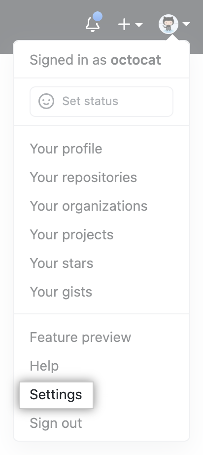
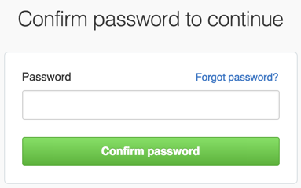
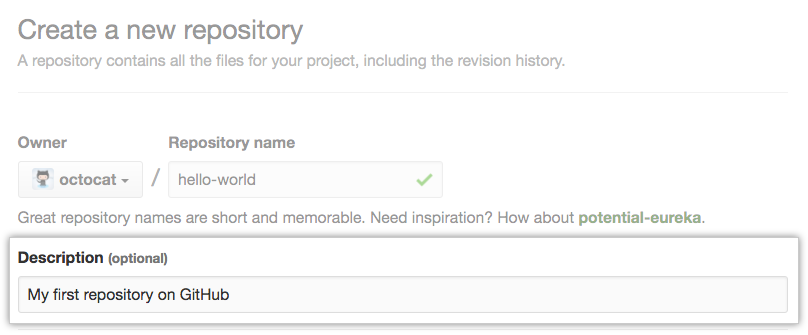

# Creating Snapshots

## Initializing a Repository

- `git init`

## Staging Files

- `git add <File-Name>`
- `git add .`

## Viewing The Status

- `git status`
- `git status -s`

## Committing The Staged Files

- `git commit -m "Message"`
- `git commit -a -m "Message"`
- `git commmit`

## Removing Files

- `git rm <File-Name>`
- `git rm --cached <File-Name>` _// Removes from staging area only_
- `git rm <Folder-Name> -r`
- `git rm <Folder-Name> -r` _// Removes from staging area only_

## Renaming or Moving Files

- `git mv <Old-File-Name> <New-File-Name>`

## Viewing The Staged / Unstaged Changes

- `git diff` _**// Shows unstaged changes**_
- `git diff --staged` _// Shows unstaged changes_
- `git diff --cached` _// Shows unstaged changes_

## Viewing The History

- `git log` _// Full History_
- `git log --oneline` _// Summary History_
- `git log --reverse` _// Lists the commits from the oldest to the newest_

## Unstaging Files (Undoing git add)

- `git restore --staged <File-Name>` _// Copies the last version of file.js from repo to index_

## Generating a New SSH key

- `mkdir ~/.ssh`
- `touch ~/.ssh/config`
- `ssh-keygen -t ed25519 -C "email"`
  _// Note: If you are using a legacy system that doesn't support the Ed25519 algorithm, use:_
- `ssh-keygen -t rsa -b 4096 -C "email"`
- Add the Following Code to config file _// Note: If you chose not to add a passphrase to your key, you should omit the UseKeychain line_

```config
Host *
  AddKeysToAgent yes
  UseKeychain yes
  IdentityFile ~/.ssh/<Name-of-private-keyfile>
```

- `ssh-add -K ~/.ssh/<Name-of-Private-Keyfile>`

## Adding a new SSH key to your GitHub account

1. `pbcopy < ~/.ssh/<Name-of-Private-Keyfile>.pub`
2. In the upper-right corner of any page, click your profile photo, then click Settings.

   - 

3. In the user settings sidebar, click SSH and GPG keys.

   - 

4. Click New SSH key or Add SSH key.

   - 

5. In the "Title" field, add a descriptive label for the new key. For example, if you're using a personal Mac, you might call this key "Personal MacBook Air".
6. Paste your key into the "Key" field.

   - 

7. Click Add SSH key.

   - 

8. If prompted, confirm your GitHub password.
   - 

## create a new repository on github

1. In the upper-right corner of any page, use the drop-down menu, and select New repository.

   - 

2. Type a short, memorable name for your repository. For example, "hello-world".

   - 

3. Optionally, add a description of your repository. For example, "My first repository on GitHub."

   - 

4. Choose a repository visibility. For more information, see "About repository visibility."

   - 

5. Click Create repository.

   - 

6. Copy the ssh address

   - 

7. `git remote add origin git@github.com:AliRamy/hello-world.git`
8. `git push origin master`

## Create a new repository on the command line

1. `echo "# Repository_Name" >> README.md`
2. `git init`
3. `git add README.md`
4. `git commit -m "first commit"`
5. `git branch -M main` or `git branch -M master`
6. `git remote add origin git@github.com:username/Repository_Name.git`
7. `git push -u origin main` or `git push origin master`
